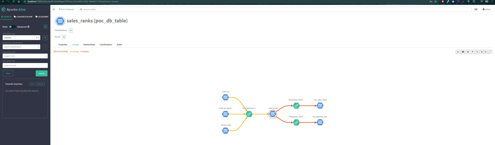
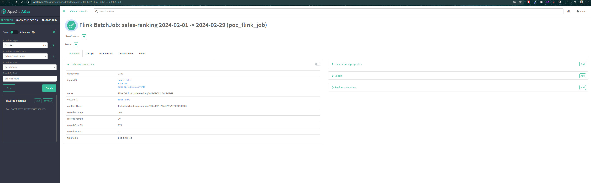

# db-flink-batch-poc

Batch sales-rankings pipeline with **three sources**:

| Source | Description |
|---|---|
| RustFS (S3-compatible) | Daily `sales_YYYYMMDD.csv` files, one per day in `[--from, --to]` |
| PostgreSQL | `source_sales` table, date-filtered JDBC query |
| HTTP / sales-api | Go REST service — polled once at job start via `GET /api/sales/events` |

All events are unioned, then aggregated into city and salesman rankings written to PostgreSQL.

## Services & ports

| Service | Port |
|---|---|
| Flink UI | [localhost:8084](http://localhost:8084) |
| PostgreSQL | localhost:5434 |
| RustFS console | [localhost:7481](http://localhost:7481) |
| sales-api | [localhost:8085](http://localhost:8085) |
| Apache Atlas | [localhost:21000](http://localhost:21000) |

## Start

### Option A — docker compose (all-in-one)

Starts postgres + Flink cluster + submits the job in one command.

```bash
cd db-flink-batch-poc
docker compose up --build          # default: Feb 2024
```

Override dates at runtime:

```bash
JOB_FROM_DATE=2024-01-01 JOB_TO_DATE=2024-01-31 docker compose up
```

`flink-job-submit` blocks until the batch job finishes, then exits with code 0.

### Option B — build.sh + submit.sh (cluster already running)

Use these scripts when the cluster is already up (`docker compose up` without the job)
and you want to submit jobs manually with different date ranges.

**1. Start the cluster (skip the job-submit service):**

```bash
docker compose up rustfs postgres sales-api sales-csv-generator flink-jobmanager flink-taskmanager atlas -d
```

**2. Build the fat JAR:**

```bash
./build.sh
# Output: flink-job/target/flink-job-1.0.jar
```

**3. Truncate the sink table (Optional):**

```bash
docker exec db-flink-batch-poc-postgres-1 psql -U poc -d salesdb -c "TRUNCATE sales_ranks;"
```

**4. Submit with any date range:**

```bash
./submit.sh --from 2024-01-01 --to 2024-01-31
./submit.sh --from 2024-02-01 --to 2024-02-29
./submit.sh --from 2024-01-01 --to 2024-03-31
```

`submit.sh` connects to `flink-jobmanager:8081` via the compose network,
mounts the local JAR, and blocks until the job completes.

**To submit a new JAR version after a code change:**

```bash
# 1. Edit BatchJob.java (or any source file)
# 2. Rebuild — fast on subsequent runs due to ~/.m2 cache
./build.sh
# 3. Submit as usual — picks up the new JAR automatically
./submit.sh --from 2024-02-01 --to 2024-02-29
```

No cluster restart needed. The cluster stays up; only the JAR is replaced.

## Monitoring — Flink UI

Open **[http://localhost:8084](http://localhost:8084)** while the cluster is running.

| Section | Path | What to look for |
|---|---|---|
| Running jobs | **Jobs → Running Jobs** | Job appears here while `submit.sh` / `flink-job-submit` is blocking |
| Completed jobs | **Jobs → Completed Jobs** | Job moves here on success (green) or failure (red) |
| Job graph | Click the job → **Overview** tab | Shows three sources (RustFS, JDBC, HTTP) unioned into two parallel pipelines (Stream A: City, Stream B: Salesman) |
| Task metrics | Click a task node → **Metrics** tab | Records in/out, throughput |
| Logs | Click a task node → **TaskManagers** tab → select TM → **Logs** | Full Flink execution logs including `[BatchJob]` lines |
| Exceptions | Click the job → **Exceptions** tab | Full stack trace if the job failed |

> **Tip:** Because this is a batch job it runs fast (a few seconds). If you miss it in
> Running Jobs, check Completed Jobs immediately after `submit.sh` returns.

## Query results

```bash
# City rankings (ranked by total sales)
docker exec db-flink-batch-poc-postgres-1 psql -U poc -d salesdb \
  -c "SELECT rank, city, total_sales, window_end FROM top_cities_latest;"

# Salesman rankings
docker exec db-flink-batch-poc-postgres-1 psql -U poc -d salesdb \
  -c "SELECT rank, salesman_name, salesman_id, total_sales FROM top_salesmen_latest;"

# Raw output -- all data
docker exec db-flink-batch-poc-postgres-1 psql -U poc -d salesdb \
  -c "SELECT rank_type, group_key, total_sales, window_start, window_end FROM sales_ranks ORDER BY rank_type, total_sales DESC;"
```

## Data Lineage — Apache Atlas

Open **[http://localhost:21000](http://localhost:21000)** (admin / admin) after the job runs.

Atlas tracks every batch run as a **Process** entity linking the three input sources to the `sales_ranks` output, and a pair of static **VIEW** processes linking `sales_ranks` to the two PostgreSQL views.

### Entities registered

| Entity | Atlas type | Role |
|---|---|---|
| `source_sales` | `poc_db_table` | Input — PostgreSQL |
| `sales-csv` | `poc_s3_bucket` | Input — RustFS S3 bucket |
| `sales-api /api/sales/events` | `http_endpoint` | Input — HTTP REST |
| `sales_ranks` | `poc_db_table` | Output — sink table |
| `top_cities_latest` | `poc_db_table` | Output — PostgreSQL view |
| `top_salesmen_latest` | `poc_db_table` | Output — PostgreSQL view |
| `Flink BatchJob: sales-ranking <from> -> <to>` | `Process` | One entity per run |
| `PostgreSQL VIEW: top_cities_latest` | `Process` | View derivation (static) |
| `PostgreSQL VIEW: top_salesmen_latest` | `Process` | View derivation (static) |

### Lineage graph

Each run adds a new Process node to Atlas. The full lineage visible from `sales_ranks`:

```
source_sales (PostgreSQL) ──┐
sales-csv    (RustFS S3)  ──┼──► Flink BatchJob ──► sales_ranks ──► VIEW ──► top_cities_latest
sales-api    (HTTP)       ──┘                                   └──► VIEW ──► top_salesmen_latest
```



Navigate to **Search → sales_ranks → Lineage tab** to see this graph in the Atlas UI.
Every historical run is listed in **Search → type: Process → name contains "Flink BatchJob"**, with the date range encoded in its `qualifiedName`.



### Note on startup

Atlas (embedded HBase + Solr) takes ~2 minutes to fully initialize. `flink-job-submit` waits for the Atlas health check to pass before running. If you bring the stack up with `docker compose up`, allow Atlas to become healthy before the job starts.

## Stop

```bash
docker compose down -v
```
